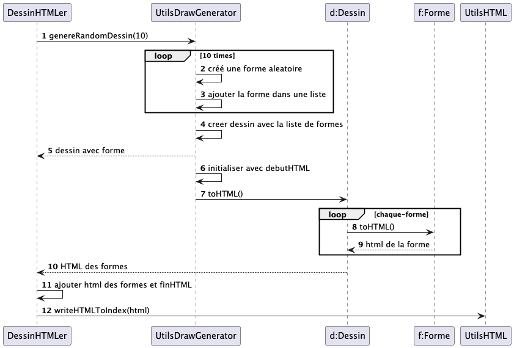

# Paint LPDAOO

Ce projet a pour vocation de repasser sur les concepts objet 
- classes, objets, attributs, méthodes
- héritage
- composition
- polymorphisme

Pour générer un dessin de type "paint" vous pouvez aller dans le fichier `src/DessinHTMLer.java` et lancer le main. 
Si vous le souhaitez vous pouvez changer le nombre de formes à générer en modifiant la valeur de la variable `nbFormes` dans le main.

Lors de l'execution du main, le programme suis la logique suivante :

Le résultat de l'execution de ce projet est un affichage en html d'un dessin composé de formes géométriques. Vous pouvez le voir dans le fichier `Ressources/index.html`.
Ce dessing mobilise le Canvas HTML et le JavaScript pour dessiner les formes. ([source](https://developer.mozilla.org/en-US/docs/Web/HTML/Element/canvas))

